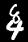

# MIT 6.86x — Project 3: Neural Networks

## Overview

This project covers the full arc of neural network development, starting from a hand-coded implementation using only NumPy and progressing to neural network implementation and training with PyTorch.

The project is divided into three parts. The first builds a small fully connected network entirely from scratch, manually implementing forward propagation, gradient computation, and backpropagation to develop a ground-up understanding of how neural networks learn. The second part applies PyTorch to the MNIST handwritten digit classification problem, comparing a simple dense network against a convolutional architecture to study the impact of spatial feature learning on accuracy. The third part extends this to a multi-task learning problem — recognizing two stacked digits in a single image simultaneously — using a shared convolutional backbone with two independent output heads.

Together, the three parts demonstrate both the mathematical foundations of deep learning and practical engineering skills including model design, regularization, data preprocessing, and evaluation methodology.

---

## Highlights

- Implemented forward propagation, manual gradient computation, and backpropagation **from scratch using only NumPy**, before transitioning to PyTorch's built-in training and gradient computation workflow
- Built and trained feedforward and convolutional neural networks using **PyTorch** (`torch.nn`, `torch.optim`, `torch.nn.functional`)
- Compared dense and convolutional architectures on MNIST, achieving **97.86% (FC)** vs **99.16% (CNN)** test accuracy
- Designed a **dual-output network** for multi-digit recognition using a shared feature extractor and two independent classification heads
- Achieved **~99.16%** test accuracy on MNIST and **~98.24% / ~97.78%** per-digit accuracy on MultiMNIST with the CNN
- Applied proper ML engineering practices: batching, shuffling, train/validation/test splits, and Dropout regularization

---

## Project Structure

```
project_3/
├── nn/                        # Part 1: Neural network from scratch
│   └── neural_nets.py
├── mnist/                     # Part 2: MNIST digit classification with PyTorch
│   ├── nnet_fc.py             # Fully connected network
│   ├── nnet_cnn.py            # Convolutional neural network
│   ├── train_utils.py         # Training loop, batching, evaluation utilities
│   └── utils.py               # Data loading and helpers
└── twodigit/                  # Part 3: Two-digit (multi-output) recognition
    ├── mlp.py                 # Multi-Layer Perceptron for two-digit images
    ├── conv.py                # CNN for two-digit images
    ├── train_utils.py         # Training loop adapted for dual-output models
    └── utils_multiMNIST.py    # Multi-digit dataset loader
```

---

## How to Run

```bash
# Part 1 — Neural network from scratch
python nn/neural_nets.py

# Part 2 — MNIST classification
python mnist/nnet_fc.py
python mnist/nnet_cnn.py

# Part 3 — Two-digit recognition
python twodigit/mlp.py
python twodigit/conv.py
```

---

## Part 1 — Neural Network from Scratch (`nn/`)

A fully connected neural network implemented **without any deep learning frameworks**, using only NumPy.

### Architecture
- **Input:** 2 features
- **Hidden layer:** 3 neurons with **ReLU** activation
- **Output layer:** 1 neuron with a **linear** (identity) activation

### Key Concepts Implemented
- Forward propagation, manual gradient computation, and backpropagation from scratch — before transitioning to PyTorch's built-in model training workflow
- Gradient descent weight updates
- Cost function: Mean Squared Error (MSE)

The network is trained to learn the function `f(x₁, x₂) = 3·x₁ + 4·x₂` from a small set of labeled training points.

### Results
All 5 test points passed after 10 training epochs:

| Input | Target | Prediction |
|---|---|---|
| (1, 1) | 7.0 | 7.038 |
| (2, 2) | 14.0 | 14.043 |
| (3, 3) | 21.0 | 21.047 |
| (5, 5) | 35.0 | 35.056 |
| (10, 10) | 70.0 | 70.078 |

---

## Part 2 — MNIST Digit Classification (`mnist/`)

Single-digit handwritten digit classification on the classic [MNIST dataset](http://yann.lecun.com/exdb/mnist/) (70,000 grayscale 28×28 images, 10 classes). Data preprocessing included normalization, batching (batch size 32), shuffling, and a train/validation/test split to monitor learning progress and detect overfitting.

### Models

#### Fully Connected Network (`nnet_fc.py`)
```
Input (784) → Linear(784→128) → LeakyReLU → Linear(128→10)
```

#### Convolutional Neural Network (`nnet_cnn.py`)
```
Input (1×28×28)
  → Conv2d(1→32, 3×3) → ReLU → MaxPool2d(2×2)
  → Conv2d(32→64, 3×3) → ReLU → MaxPool2d(2×2)
  → Flatten → Linear(1600→128) → Dropout(0.5) → Linear(128→10)
```

Compared with the fully connected network, the CNN achieved significantly higher accuracy by learning **spatial features** such as edges, curves, and digit stroke patterns directly from the 2D image structure. The fully connected network flattens the image into a 1D vector, discarding all spatial relationships between pixels. The convolutional layers instead apply learned filters across local regions of the image, building up increasingly abstract representations — from edges in early layers to digit components in later ones. Dropout was applied to reduce overfitting in the deeper representation space. This illustrates why convolutional architectures dominate modern computer vision tasks.

### Training
- Optimizer: **SGD** (with optional Nesterov momentum)
- Loss: **Cross-Entropy** (`torch.nn.functional.cross_entropy`)
- Epochs: 30 | Batch size: 32

### Results

| Model | Train Accuracy (Ep. 30) | Val Accuracy (Ep. 30) | **Test Accuracy** |
|---|---|---|---|
| Fully Connected | 99.99% | 98.13% | **97.86%** |
| CNN | 99.76% | 99.16% | **99.16%** |

Training and validation performance were compared across all 30 epochs to study overfitting and generalization. The FC network showed increasing divergence between training and validation loss in later epochs, while the CNN with Dropout maintained tighter generalization.

---

## Part 3 — Two-Digit Recognition (`twodigit/`)

A more challenging multi-output classification task. Images are **42×28** grayscale composites of two stacked MNIST digits. Unlike traditional single-label classification, this task requires the network to perform **two classifications simultaneously** using a shared feature extractor and two independent output heads — a core multi-task learning pattern. The model must predict both the top digit and the bottom digit from a single forward pass.

Data preprocessing included loading from compressed pickle files, batching (batch size 64), shuffling, and maintaining separate train, validation, and test splits to monitor generalization for both output heads independently.

### Sample Input Image

Below is an example of a 42×28 MultiMNIST image — two vertically stacked MNIST digits that the network must classify simultaneously:



### Models

#### MLP (`mlp.py`)
```
Input (42×28 = 1176) → Flatten → Linear(1176→64) → ReLU
  → head_first:  Linear(64→10)   # top digit prediction
  → head_second: Linear(64→10)   # bottom digit prediction
```

#### CNN (`conv.py`)
```
Input (1×42×28)
  → Conv2d(1→32, 3×3, pad=1) → ReLU → MaxPool2d(2×2)
  → Conv2d(32→64, 3×3, pad=1) → ReLU → MaxPool2d(2×2)
  → Flatten → Linear(4480→128) → ReLU → Dropout(0.5)
  → head_first:  Linear(128→10)  # top digit prediction
  → head_second: Linear(128→10)  # bottom digit prediction
```

### Training
- Optimizer: **SGD** with momentum (`torch.optim.SGD`)
- Loss: Joint cross-entropy — `0.5 × (loss₁ + loss₂)` — trained end-to-end
- Both digit heads are trained simultaneously through shared gradients
- Both output heads are optimized simultaneously, with gradients from both losses updating the shared feature extractor.
- Epochs: 30 | Batch size: 64

### Results

| Model | Test Accuracy (digit 1) | Test Accuracy (digit 2) |
|---|---|---|
| MLP | 92.54% | 91.81% |
| **CNN** | **98.24%** | **97.78%** |

Models were evaluated using training, validation, and held-out test sets to monitor learning progress and detect overfitting across both output heads. The CNN substantially outperformed the MLP on this task — the added spatial structure of the taller 42×28 image made convolutional feature extraction especially impactful, as the two digit regions are spatially separable and the filters can learn region-specific patterns without any explicit supervision about digit location.

---

## Technologies Used

| Technology | Purpose |
|---|---|
| **Python 3** | Primary language |
| **PyTorch** — `torch.nn`, `torch.optim`, `torch.nn.functional` | Network construction, loss functions, optimizers |
| **NumPy** | Manual backpropagation, numerical computation |
| **tqdm** | Training progress bars |
| **gzip / pickle** | Dataset serialization and loading |

### Data Preprocessing & ML Engineering
- **Batching** and **shuffling** of training data each epoch
- **Train / validation / test splits** on all datasets
- **Normalization** of pixel values
- Models were evaluated on training, validation, and held-out test sets to monitor learning progress and detect overfitting

---

## Key Learning Outcomes

- Implemented forward propagation, manual gradient computation, and backpropagation from scratch before using PyTorch's built-in gradient computation and optimization workflow
- Built and compared feedforward vs. convolutional architectures, understanding *why* CNNs outperform dense networks on image data
- Designed multi-head / multi-output models for multi-task classification
- Applied regularization techniques: **Dropout**, **SGD momentum**, **Nesterov acceleration**
- Compared training and validation performance across architectures to study overfitting and generalization
- Gained hands-on experience with core PyTorch modules: `torch.nn.Module`, `torch.nn.Conv2d`, `torch.nn.Linear`, `torch.optim.SGD`, `torch.nn.functional.cross_entropy`
